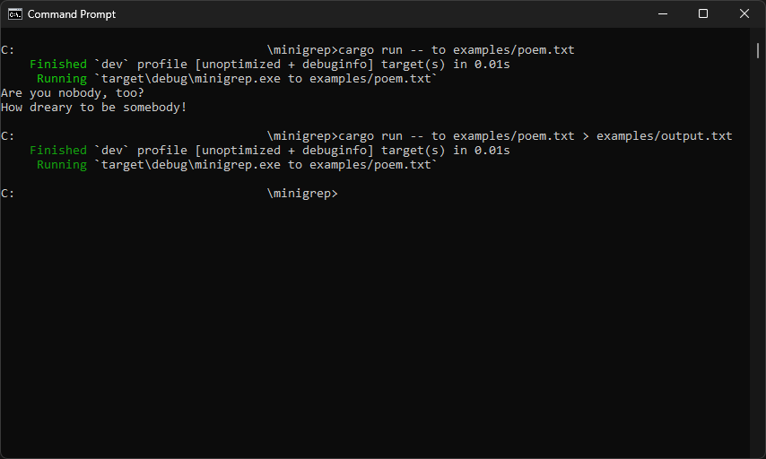

# minigrep

🔍 It's a command line tool to searches for the text within the desired file and returns the entire line that contains the desired text.

## 🚀 Getting started

First make sure that you have Rust installed; 
And then clone the repository in your machine;

To execute the project you need to execute the `cargo run` followed by two parameters `query` and `file_path`; 
Follow the example bellow:

`$ cargo run -- text example.txt`

By default the program will execute the command as case sensitive; 
If you want to change that you need to set a environment variable named `IGNORE_CASE` as true; 
Follow the example bellow:

`$ IGNORE_CASE=1 cargo run -- text example.txt`

If you're using PowerShell: 
`PS> $Env:IGNORE_CASE=1; cargo run -- text example.txt` 
`PS> Remove-Item Env:IGNORE_CASE`

And if you want to redirect the output response to other file we need to add `>` and a second `file_path`; 
Follow the example bellow:

`$ cargo run -- text example.txt > output.txt`

I created an `examples` folder with a `poem.txt` file that you can use to do some tests.

---

Made with ♥ by Vilson Castilho
